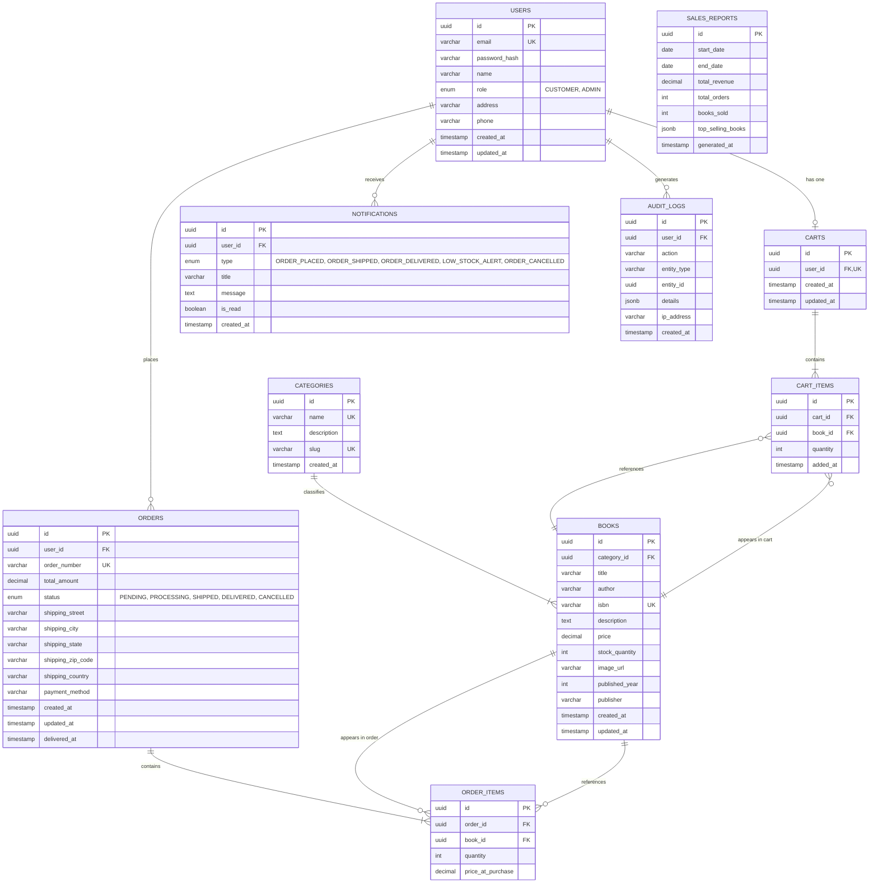

# ER Diagram — Bookify

## Overview

This Entity-Relationship diagram shows the complete database schema for the Bookify platform. All tables, columns, data types, primary keys (PK), foreign keys (FK), and unique constraints (UK) are defined below.

---



---

## Table Descriptions

| Table | Description | Key Relationships |
|-------|-------------|-------------------|
| **USERS** | All platform users (customers and admins) with authentication credentials | → Cart (1:1), Orders (1:N), Notifications (1:N) |
| **CATEGORIES** | Book genres/categories for classification | → Books (1:N) |
| **BOOKS** | Complete book catalog with inventory and pricing | ← Category, → CartItems (1:N), → OrderItems (1:N) |
| **CARTS** | Shopping carts (one per user, persistent across sessions) | ← User (1:1), → CartItems (1:N) |
| **CART_ITEMS** | Individual books added to a cart with quantities | ← Cart, → Book |
| **ORDERS** | Customer purchase orders with shipping and status tracking | ← User, → OrderItems (1:N) |
| **ORDER_ITEMS** | Line items in an order (books with quantity and price at purchase) | ← Order, → Book |
| **NOTIFICATIONS** | User notifications for order updates and alerts | ← User |
| **SALES_REPORTS** | Aggregated analytics reports generated by admin | Standalone |
| **AUDIT_LOGS** | System-wide audit trail for compliance and debugging | ← User (optional) |

---

## Key Constraints & Indexes

### Primary Keys
- All tables use `uuid` as primary key for distributed scalability

### Unique Constraints
- `USERS.email` - Prevent duplicate accounts
- `BOOKS.isbn` - Ensure unique book identification
- `CATEGORIES.name` - Prevent duplicate category names
- `CATEGORIES.slug` - SEO-friendly unique identifiers
- `ORDERS.order_number` - Human-readable unique order identifier
- `CARTS.user_id` - One cart per user

### Foreign Key Constraints
- `BOOKS.category_id → CATEGORIES.id` (ON DELETE SET NULL)
- `CARTS.user_id → USERS.id` (ON DELETE CASCADE)
- `CART_ITEMS.cart_id → CARTS.id` (ON DELETE CASCADE)
- `CART_ITEMS.book_id → BOOKS.id` (ON DELETE CASCADE)
- `ORDERS.user_id → USERS.id` (ON DELETE RESTRICT)
- `ORDER_ITEMS.order_id → ORDERS.id` (ON DELETE CASCADE)
- `ORDER_ITEMS.book_id → BOOKS.id` (ON DELETE RESTRICT)
- `NOTIFICATIONS.user_id → USERS.id` (ON DELETE CASCADE)
- `AUDIT_LOGS.user_id → USERS.id` (ON DELETE SET NULL)

### Recommended Indexes

| Table | Index | Purpose |
|-------|-------|---------|
| `BOOKS` | `(category_id, stock_quantity)` | Fast category filtering with stock check |
| `BOOKS` | `(title, author)` | Full-text search optimization |
| `CART_ITEMS` | `(cart_id, book_id)` | Prevent duplicate items in cart (unique composite) |
| `ORDERS` | `(user_id, status)` | User order history queries |
| `ORDERS` | `(status, created_at)` | Admin order dashboard filtering |
| `ORDER_ITEMS` | `(order_id)` | Fast order details retrieval |
| `NOTIFICATIONS` | `(user_id, is_read)` | Unread notification count |
| `AUDIT_LOGS` | `(entity_type, entity_id)` | Entity audit trail lookup |
| `AUDIT_LOGS` | `(created_at)` | Time-based log queries |

---

## Enumeration Types

### User Role
```sql
CREATE TYPE user_role AS ENUM ('CUSTOMER', 'ADMIN');
```

### Order Status
```sql
CREATE TYPE order_status AS ENUM (
    'PENDING',      -- Order placed, awaiting processing
    'PROCESSING',   -- Order being prepared
    'SHIPPED',      -- Order dispatched
    'DELIVERED',    -- Order completed
    'CANCELLED'     -- Order cancelled
);
```

### Notification Type
```sql
CREATE TYPE notification_type AS ENUM (
    'ORDER_PLACED',
    'ORDER_SHIPPED',
    'ORDER_DELIVERED',
    'LOW_STOCK_ALERT',
    'ORDER_CANCELLED'
);
```

---

## Sample SQL Schema Snippets

### Users Table
```sql
CREATE TABLE users (
    id UUID PRIMARY KEY DEFAULT gen_random_uuid(),
    email VARCHAR(255) UNIQUE NOT NULL,
    password_hash VARCHAR(255) NOT NULL,
    name VARCHAR(255) NOT NULL,
    role user_role NOT NULL DEFAULT 'CUSTOMER',
    address TEXT,
    phone VARCHAR(20),
    created_at TIMESTAMP DEFAULT NOW(),
    updated_at TIMESTAMP DEFAULT NOW()
);

CREATE INDEX idx_users_email ON users(email);
```

### Books Table
```sql
CREATE TABLE books (
    id UUID PRIMARY KEY DEFAULT gen_random_uuid(),
    category_id UUID REFERENCES categories(id) ON DELETE SET NULL,
    title VARCHAR(500) NOT NULL,
    author VARCHAR(255) NOT NULL,
    isbn VARCHAR(20) UNIQUE,
    description TEXT,
    price DECIMAL(10, 2) NOT NULL CHECK (price >= 0),
    stock_quantity INT NOT NULL DEFAULT 0 CHECK (stock_quantity >= 0),
    image_url VARCHAR(500),
    published_year INT,
    publisher VARCHAR(255),
    created_at TIMESTAMP DEFAULT NOW(),
    updated_at TIMESTAMP DEFAULT NOW()
);

CREATE INDEX idx_books_category ON books(category_id);
CREATE INDEX idx_books_search ON books USING GIN (to_tsvector('english', title || ' ' || author));
```

### Orders Table
```sql
CREATE TABLE orders (
    id UUID PRIMARY KEY DEFAULT gen_random_uuid(),
    user_id UUID NOT NULL REFERENCES users(id) ON DELETE RESTRICT,
    order_number VARCHAR(50) UNIQUE NOT NULL,
    total_amount DECIMAL(10, 2) NOT NULL,
    status order_status NOT NULL DEFAULT 'PENDING',
    shipping_street VARCHAR(255),
    shipping_city VARCHAR(100),
    shipping_state VARCHAR(100),
    shipping_zip_code VARCHAR(20),
    shipping_country VARCHAR(100),
    payment_method VARCHAR(50),
    created_at TIMESTAMP DEFAULT NOW(),
    updated_at TIMESTAMP DEFAULT NOW(),
    delivered_at TIMESTAMP
);

CREATE INDEX idx_orders_user ON orders(user_id);
CREATE INDEX idx_orders_status ON orders(status);
CREATE INDEX idx_orders_created ON orders(created_at DESC);
```

---

## Data Integrity Rules

1. **Stock Validation**: Cart items and order items cannot exceed available `books.stock_quantity`
2. **Order Immutability**: Once an order is `SHIPPED` or `DELIVERED`, it cannot be modified
3. **Price Snapshot**: `ORDER_ITEMS.price_at_purchase` captures book price at order time (historical record)
4. **Cascade Deletes**: Deleting a cart/order removes associated items automatically
5. **Audit Trail**: All critical operations (order creation, status changes, inventory updates) logged in `AUDIT_LOGS`
6. **Cart Persistence**: Cart remains active across user sessions until explicitly cleared or checkout

---

## Scalability Considerations

- **Partitioning**: `ORDERS` and `AUDIT_LOGS` can be partitioned by `created_at` for time-series queries
- **Archiving**: Old delivered orders (>1 year) can be moved to archive tables
- **Caching**: Book catalog queries cached with Redis to reduce database load
- **Read Replicas**: Separate read replicas for analytics and reporting queries
- **UUID Keys**: Distributed-friendly primary keys for horizontal scaling