```mermaid
classDiagram
    direction TB

    %% ===== DOMAIN MODELS =====

    class User {
        -id: string
        -email: string
        -passwordHash: string
        -name: string
        -role: UserRole
        -address: string
        -phone: string
        -createdAt: Date
        +register(dto: RegisterDto): User
        +login(email: string, password: string): string
        +updateProfile(dto: UpdateProfileDto): void
        +changePassword(oldPass: string, newPass: string): void
        +getOrders(): Order[]
    }

    class UserRole {
        <<enumeration>>
        CUSTOMER
        ADMIN
    }

    class Book {
        -id: string
        -title: string
        -author: string
        -isbn: string
        -description: string
        -price: number
        -stockQuantity: number
        -categoryId: string
        -imageUrl: string
        -publishedYear: number
        -publisher: string
        -createdAt: Date
        -updatedAt: Date
        +isAvailable(): boolean
        +reduceStock(quantity: number): void
        +increaseStock(quantity: number): void
        +updateDetails(dto: UpdateBookDto): void
        +isLowStock(): boolean
    }

    class Category {
        -id: string
        -name: string
        -description: string
        -slug: string
        -createdAt: Date
        +getBooks(): Book[]
        +getBooksCount(): number
    }

    class Cart {
        -id: string
        -userId: string
        -createdAt: Date
        -updatedAt: Date
        +addItem(bookId: string, quantity: number): CartItem
        +removeItem(itemId: string): void
        +updateItemQuantity(itemId: string, quantity: number): void
        +getTotal(): number
        +clear(): void
        +getItems(): CartItem[]
    }

    class CartItem {
        -id: string
        -cartId: string
        -bookId: string
        -quantity: number
        -addedAt: Date
        +updateQuantity(qty: number): void
        +getSubtotal(): number
    }

    class Order {
        -id: string
        -userId: string
        -orderNumber: string
        -totalAmount: number
        -status: OrderStatus
        -shippingAddress: Address
        -paymentMethod: string
        -createdAt: Date
        -updatedAt: Date
        -deliveredAt: Date?
        +calculateTotal(): number
        +updateStatus(newStatus: OrderStatus): void
        +cancel(): void
        +getItems(): OrderItem[]
        +canBeCancelled(): boolean
    }

    class OrderStatus {
        <<enumeration>>
        PENDING
        PROCESSING
        SHIPPED
        DELIVERED
        CANCELLED
    }

    class OrderItem {
        -id: string
        -orderId: string
        -bookId: string
        -quantity: number
        -priceAtPurchase: number
        +getSubtotal(): number
    }

    class Address {
        -street: string
        -city: string
        -state: string
        -zipCode: string
        -country: string
        +format(): string
        +validate(): boolean
    }

    class Notification {
        -id: string
        -userId: string
        -type: NotificationType
        -title: string
        -message: string
        -isRead: boolean
        -createdAt: Date
        +markAsRead(): void
    }

    class NotificationType {
        <<enumeration>>
        ORDER_PLACED
        ORDER_SHIPPED
        ORDER_DELIVERED
        LOW_STOCK_ALERT
        ORDER_CANCELLED
    }

    class SalesReport {
        -id: string
        -startDate: Date
        -endDate: Date
        -totalRevenue: number
        -totalOrders: number
        -topSellingBooks: Book[]
        -generatedAt: Date
        +generate(): void
        +exportToPDF(): void
    }

    %% ===== SERVICE LAYER =====

    class AuthService {
        -userRepo: IUserRepository
        -jwtSecret: string
        +register(dto: RegisterDto): User
        +login(email: string, password: string): string
        +validateToken(token: string): User
        +hashPassword(password: string): string
        +comparePassword(plain: string, hash: string): boolean
    }

    class ProductService {
        -bookRepo: IBookRepository
        -categoryRepo: ICategoryRepository
        -searchStrategy: ISearchStrategy
        +getAllBooks(filters: BookFilters): Book[]
        +getBookById(id: string): Book
        +searchBooks(query: string): Book[]
        +getBooksByCategory(categoryId: string): Book[]
        +createBook(dto: CreateBookDto): Book
        +updateBook(id: string, dto: UpdateBookDto): Book
        +deleteBook(id: string): void
        +setSearchStrategy(strategy: ISearchStrategy): void
    }

    class ISearchStrategy {
        <<interface>>
        +search(query: string, books: Book[]): Book[]
    }

    class TitleSearchStrategy {
        +search(query: string, books: Book[]): Book[]
    }

    class AuthorSearchStrategy {
        +search(query: string, books: Book[]): Book[]
    }

    class FullTextSearchStrategy {
        +search(query: string, books: Book[]): Book[]
    }

    class CartService {
        -cartRepo: ICartRepository
        -bookRepo: IBookRepository
        +getCart(userId: string): Cart
        +addToCart(userId: string, bookId: string, qty: number): CartItem
        +updateCartItem(itemId: string, qty: number): void
        +removeCartItem(itemId: string): void
        +clearCart(userId: string): void
        +validateStock(bookId: string, qty: number): boolean
    }

    class OrderService {
        -orderRepo: IOrderRepository
        -cartService: CartService
        -inventoryService: InventoryService
        -validationChain: OrderValidator
        +createOrder(userId: string, dto: CreateOrderDto): Order
        +getOrderById(id: string): Order
        +getCustomerOrders(userId: string): Order[]
        +getAllOrders(filters: OrderFilters): Order[]
        +updateOrderStatus(orderId: string, status: OrderStatus): Order
        +cancelOrder(orderId: string): void
    }

    class InventoryService {
        -bookRepo: IBookRepository
        -notificationService: NotificationService
        +validateStock(items: CartItem[]): boolean
        +reserveStock(items: CartItem[]): void
        +releaseStock(items: OrderItem[]): void
        +updateStock(bookId: string, quantity: number): void
        +getLowStockBooks(threshold: number): Book[]
        +checkAndNotifyLowStock(): void
    }

    class NotificationService {
        -notificationRepo: INotificationRepository
        -observers: INotificationObserver[]
        +subscribe(observer: INotificationObserver): void
        +notify(event: NotificationEvent): void
        +sendNotification(userId: string, notification: Notification): void
        +getUserNotifications(userId: string): Notification[]
        +markAsRead(notificationId: string): void
    }

    class INotificationObserver {
        <<interface>>
        +onEvent(event: NotificationEvent): void
    }

    class EmailNotificationObserver {
        +onEvent(event: NotificationEvent): void
    }

    class InAppNotificationObserver {
        +onEvent(event: NotificationEvent): void
    }

    class AnalyticsService {
        -orderRepo: IOrderRepository
        -bookRepo: IBookRepository
        +generateSalesReport(startDate: Date, endDate: Date): SalesReport
        +getTotalRevenue(period: string): number
        +getTopSellingBooks(limit: number): Book[]
        +getOrderStats(): OrderStats
    }

    %% ===== VALIDATION CHAIN =====

    class OrderValidator {
        <<abstract>>
        #next: OrderValidator
        +setNext(validator: OrderValidator): OrderValidator
        +validate(order: Order): ValidationResult
        #doValidate(order: Order): ValidationResult*
    }

    class StockValidator {
        #doValidate(order: Order): ValidationResult
    }

    class AddressValidator {
        #doValidate(order: Order): ValidationResult
    }

    class PaymentValidator {
        #doValidate(order: Order): ValidationResult
    }

    class UserValidator {
        #doValidate(order: Order): ValidationResult
    }

    %% ===== REPOSITORY INTERFACES =====

    class IUserRepository {
        <<interface>>
        +findById(id: string): User
        +findByEmail(email: string): User
        +save(user: User): User
        +update(user: User): void
        +delete(id: string): void
    }

    class IBookRepository {
        <<interface>>
        +findById(id: string): Book
        +findAll(filters: BookFilters): Book[]
        +findByCategory(categoryId: string): Book[]
        +save(book: Book): Book
        +update(book: Book): void
        +delete(id: string): void
        +search(query: string): Book[]
    }

    class ICategoryRepository {
        <<interface>>
        +findById(id: string): Category
        +findAll(): Category[]
        +save(category: Category): Category
        +update(category: Category): void
        +delete(id: string): void
    }

    class ICartRepository {
        <<interface>>
        +findByUserId(userId: string): Cart
        +save(cart: Cart): Cart
        +update(cart: Cart): void
        +delete(id: string): void
    }

    class IOrderRepository {
        <<interface>>
        +findById(id: string): Order
        +findByUserId(userId: string): Order[]
        +findAll(filters: OrderFilters): Order[]
        +save(order: Order): Order
        +update(order: Order): void
        +getOrderStats(): OrderStats
    }

    class INotificationRepository {
        <<interface>>
        +findByUserId(userId: string): Notification[]
        +save(notification: Notification): Notification
        +update(notification: Notification): void
    }

    %% ===== RELATIONSHIPS =====

    User --> UserRole
    User "1" --> "1" Cart : has
    User "1" --> "*" Order : places
    User "1" --> "*" Notification : receives

    Book --> Category : belongs to
    Book "1" --> "*" CartItem : referenced in
    Book "1" --> "*" OrderItem : referenced in

    Cart "1" --> "*" CartItem : contains
    CartItem --> Book : references

    Order --> OrderStatus
    Order --> Address : ships to
    Order "1" --> "*" OrderItem : contains
    OrderItem --> Book : references

    Notification --> NotificationType

    %% Service dependencies
    AuthService --> IUserRepository
    ProductService --> IBookRepository
    ProductService --> ICategoryRepository
    ProductService --> ISearchStrategy
    ISearchStrategy <|.. TitleSearchStrategy : implements
    ISearchStrategy <|.. AuthorSearchStrategy : implements
    ISearchStrategy <|.. FullTextSearchStrategy : implements

    CartService --> ICartRepository
    CartService --> IBookRepository

    OrderService --> IOrderRepository
    OrderService --> CartService
    OrderService --> InventoryService
    OrderService --> OrderValidator

    InventoryService --> IBookRepository
    InventoryService --> NotificationService

    NotificationService --> INotificationRepository
    NotificationService --> INotificationObserver
    INotificationObserver <|.. EmailNotificationObserver : implements
    INotificationObserver <|.. InAppNotificationObserver : implements

    AnalyticsService --> IOrderRepository
    AnalyticsService --> IBookRepository

    %% Validation chain
    OrderValidator <|-- StockValidator : extends
    OrderValidator <|-- AddressValidator : extends
    OrderValidator <|-- PaymentValidator : extends
    OrderValidator <|-- UserValidator : extends
```

# Class Diagram

## Overview

This class diagram shows the major classes, their attributes, methods, and relationships across the Bookify platform. The design follows **Clean Architecture** (Controller → Service → Repository) with strong **OOP principles** and **design patterns**.

---



---

## Design Patterns in the Class Diagram

| Pattern | Where Applied | Purpose |
|---------|---------------|---------|
| **Strategy** | `ISearchStrategy` with multiple implementations | Allow switching between different search algorithms (title, author, full-text) at runtime |
| **Chain of Responsibility** | `OrderValidator` chain | Validate orders through a pipeline of validators (stock, address, payment, user) |
| **Observer** | `NotificationService` + `INotificationObserver` | Decouple order events from notification delivery (email, in-app, SMS) |
| **Repository** | `I*Repository` interfaces | Abstract data access from business logic, enable easy testing and database switching |
| **Singleton** | Database connection (not shown) | Ensure single database connection pool instance |
| **Factory** | User creation by role | Create different user types based on role |
| **State** | `OrderStatus` enum | Manage order lifecycle transitions (Pending → Processing → Shipped → Delivered) |

---

## OOP Principles Applied

| Principle | Application |
|-----------|-------------|
| **Encapsulation** | Private fields (`-`) with public methods (`+`) in all domain models. Example: `Cart.addItem()` encapsulates cart logic |
| **Abstraction** | Repository interfaces (`IUserRepository`, `IBookRepository`) hide implementation details from services |
| **Inheritance** | `OrderValidator` is extended by specific validators (`StockValidator`, `AddressValidator`) |
| **Polymorphism** | `ISearchStrategy` implementations can be swapped at runtime; validators in chain process any validator type |

---

## Layer Architecture

```
┌─────────────────────────────────────┐
│     Controllers (API Endpoints)     │
├─────────────────────────────────────┤
│     Services (Business Logic)       │
│  - AuthService                      │
│  - ProductService                   │
│  - CartService                      │
│  - OrderService                     │
│  - InventoryService                 │
│  - NotificationService              │
│  - AnalyticsService                 │
├─────────────────────────────────────┤
│   Repositories (Data Access)        │
│  - IUserRepository                  │
│  - IBookRepository                  │
│  - IOrderRepository                 │
│  - ICartRepository                  │
├─────────────────────────────────────┤
│        Database (PostgreSQL)        │
└─────────────────────────────────────┘
```

---

## Key Class Responsibilities

| Class | Responsibility |
|-------|----------------|
| `User` | Manage user authentication, profile, and roles |
| `Book` | Represent book entity with inventory tracking |
| `Cart` | Manage shopping cart operations for a user |
| `Order` | Represent customer order with status lifecycle |
| `OrderService` | Orchestrate order creation with validation and inventory management |
| `InventoryService` | Handle stock validation, reservation, and low-stock alerts |
| `NotificationService` | Send notifications through multiple channels using Observer pattern |