```mermaid
sequenceDiagram
    actor C as Customer
    actor A as Admin
    participant FE as Frontend (React)
    participant API as API Gateway
    participant Auth as Auth Service
    participant PS as Product Service
    participant CS as Cart Service
    participant OS as Order Service
    participant IS as Inventory Service
    participant NS as Notification Service
    participant DB as PostgreSQL

    Note over C, DB: Phase 1 — Customer Browses & Searches Books

    C ->> FE: Opens Bookify homepage
    FE ->> API: GET /api/books?page=1&limit=20
    API ->> PS: fetchBooks(filters)
    PS ->> DB: SELECT * FROM books WHERE stock > 0
    DB -->> PS: Book list with details
    PS -->> API: Books data
    API -->> FE: 200 OK (books array)
    FE -->> C: Display catalog grid

    C ->> FE: Searches "JavaScript Mastery"
    FE ->> API: GET /api/books/search?q=JavaScript+Mastery
    API ->> PS: searchBooks(query)
    PS ->> DB: SELECT * WHERE title LIKE '%JavaScript%' OR author LIKE '%Mastery%'
    DB -->> PS: Matching books
    PS -->> API: Search results
    API -->> FE: 200 OK (filtered books)
    FE -->> C: Show search results

    Note over C, DB: Phase 2 — Add to Cart

    C ->> FE: Clicks "Add to Cart" on book (bookId: 42, qty: 2)
    FE ->> API: POST /api/cart/items {bookId: 42, quantity: 2}
    API ->> Auth: Validate JWT Token
    Auth -->> API: Token Valid (userId: 123, role: CUSTOMER)
    
    API ->> CS: addToCart(userId, bookId, quantity)
    CS ->> DB: SELECT stock_quantity FROM books WHERE id = 42
    DB -->> CS: stock_quantity = 15
    
    alt Stock Available
        CS ->> CS: Validate quantity (2 <= 15) ✓
        CS ->> DB: INSERT INTO cart_items (cart_id, book_id, quantity)
        DB -->> CS: Cart item created
        CS ->> CS: Calculate cart total
        CS -->> API: 201 Created {cartTotal: 59.98}
        API -->> FE: Cart updated successfully
        FE -->> C: "Added to cart! Total: $59.98"
    else Insufficient Stock
        CS -->> API: 400 Bad Request "Only 1 in stock"
        API -->> FE: Error message
        FE -->> C: "Sorry, only 1 left in stock"
    end

    C ->> FE: Views cart
    FE ->> API: GET /api/cart
    API ->> CS: getCart(userId)
    CS ->> DB: SELECT ci.*, b.* FROM cart_items ci JOIN books b
    DB -->> CS: Cart items with book details
    CS -->> API: Cart data with total
    API -->> FE: 200 OK {items: [...], total: 59.98}
    FE -->> C: Display cart with items

    Note over C, DB: Phase 3 — Checkout & Place Order

    C ->> FE: Clicks "Proceed to Checkout"
    FE -->> C: Show checkout form (shipping address)
    C ->> FE: Enters shipping details & clicks "Place Order"
    
    FE ->> API: POST /api/orders {shippingAddress: {...}, paymentMethod: "COD"}
    API ->> Auth: Validate JWT Token
    Auth -->> API: Token Valid (userId: 123)
    
    API ->> OS: createOrder(userId, shippingDetails)
    OS ->> DB: BEGIN TRANSACTION
    
    %% Validate inventory
    OS ->> IS: validateAndReserveStock(cartItems)
    IS ->> DB: SELECT stock_quantity FROM books WHERE id IN (...)
    DB -->> IS: Current stock levels
    
    alt All Items In Stock
        IS ->> DB: UPDATE books SET stock_quantity = stock_quantity - qty WHERE id IN (...)
        DB -->> IS: Stock deducted
        IS -->> OS: Stock reserved successfully
        
        %% Create order
        OS ->> DB: INSERT INTO orders (user_id, total_amount, status, shipping_address)
        DB -->> OS: Order created (orderId: 999)
        
        %% Create order items
        OS ->> DB: INSERT INTO order_items (order_id, book_id, quantity, price_at_purchase)
        DB -->> OS: Order items created
        
        %% Clear cart
        OS ->> DB: DELETE FROM cart_items WHERE cart_id = (user's cart)
        DB -->> OS: Cart cleared
        
        OS ->> DB: COMMIT TRANSACTION
        
        %% Send notification
        OS ->> NS: notifyOrderPlaced(orderId, userId)
        NS ->> DB: INSERT INTO notifications (user_id, type, message)
        
        OS -->> API: 201 Created {orderId: 999, status: 'PENDING'}
        API -->> FE: Order placed successfully
        FE -->> C: "Order #999 placed! Estimated delivery: 3-5 days"
        
    else Out of Stock
        IS -->> OS: Stock insufficient for book X
        OS ->> DB: ROLLBACK TRANSACTION
        OS -->> API: 400 Bad Request "Book X out of stock"
        API -->> FE: Error response
        FE -->> C: "Sorry, some items are out of stock. Please update cart."
    end

    Note over C, DB: Phase 4 — Order Fulfillment (Admin Side)

    A ->> FE: Logs into admin dashboard
    FE ->> API: GET /api/admin/orders?status=PENDING
    API ->> Auth: Validate JWT Token (admin)
    Auth -->> API: Token Valid (role: ADMIN)
    API ->> OS: getPendingOrders()
    OS ->> DB: SELECT * FROM orders WHERE status = 'PENDING'
    DB -->> OS: Pending orders list
    OS -->> API: Orders data
    API -->> FE: 200 OK (pending orders)
    FE -->> A: Display orders dashboard

    A ->> FE: Clicks on Order #999 to view details
    FE ->> API: GET /api/admin/orders/999
    API ->> OS: getOrderDetails(999)
    OS ->> DB: SELECT o.*, oi.*, u.* FROM orders o JOIN order_items oi JOIN users u
    DB -->> OS: Complete order details
    OS -->> API: Order details
    API -->> FE: 200 OK (order data)
    FE -->> A: Show order details page

    A ->> FE: Updates status to "PROCESSING"
    FE ->> API: PATCH /api/admin/orders/999/status {status: 'PROCESSING'}
    API ->> OS: updateOrderStatus(999, 'PROCESSING')
    OS ->> DB: UPDATE orders SET status = 'PROCESSING', updated_at = NOW()
    DB -->> OS: Order updated
    
    OS ->> NS: notifyStatusChange(orderId: 999, newStatus: 'PROCESSING')
    NS ->> DB: INSERT INTO notifications (user_id, message)
    NS -->> FE: Real-time notification (if WebSocket enabled)
    
    OS -->> API: 200 OK (updated order)
    API -->> FE: Status updated
    FE -->> A: "Order status changed to PROCESSING"

    Note over A: Admin ships the package

    A ->> FE: Updates status to "SHIPPED"
    FE ->> API: PATCH /api/admin/orders/999/status {status: 'SHIPPED'}
    API ->> OS: updateOrderStatus(999, 'SHIPPED')
    OS ->> DB: UPDATE orders SET status = 'SHIPPED'
    DB -->> OS: Updated
    OS ->> NS: notifyStatusChange(999, 'SHIPPED')
    OS -->> API: 200 OK
    FE -->> A: "Order marked as SHIPPED"

    Note over C: Customer checks order status

    C ->> FE: Views "My Orders"
    FE ->> API: GET /api/orders
    API ->> OS: getCustomerOrders(userId: 123)
    OS ->> DB: SELECT * FROM orders WHERE user_id = 123
    DB -->> OS: Customer orders
    OS -->> API: Orders with latest status
    API -->> FE: 200 OK
    FE -->> C: "Order #999 - Status: SHIPPED 📦"

    Note over A: After delivery confirmation

    A ->> FE: Updates status to "DELIVERED"
    FE ->> API: PATCH /api/admin/orders/999/status {status: 'DELIVERED'}
    API ->> OS: updateOrderStatus(999, 'DELIVERED')
    OS ->> DB: UPDATE orders SET status = 'DELIVERED', delivered_at = NOW()
    DB -->> OS: Order completed
    OS ->> NS: notifyStatusChange(999, 'DELIVERED')
    OS -->> API: 200 OK
    FE -->> A: "Order completed ✓"
```

# Sequence Diagram

## Main Flow: End-to-End Book Purchase (Browse → Add to Cart → Checkout → Order Fulfillment)

This sequence diagram illustrates the complete lifecycle of a book purchase — from browsing the catalog, adding items to cart, completing checkout, through to order placement and admin fulfillment.

---



---

## Flow Summary

| Phase | Description | Key Operations |
|-------|-------------|----------------|
| **1. Browse & Search** | Customer browses catalog and searches for books | Product listing, filtering, search queries |
| **2. Add to Cart** | Customer adds books to cart with stock validation | Stock check, cart item creation, total calculation |
| **3. Checkout & Order** | Customer places order, inventory reserved, payment processed | Transaction management, stock deduction, order creation, cart clearing |
| **4. Order Fulfillment** | Admin processes order through status workflow | Status updates (PENDING → PROCESSING → SHIPPED → DELIVERED), notifications |

---

## Order Status Workflow

```
PENDING → PROCESSING → SHIPPED → DELIVERED
   ↓           ↓
CANCELLED  (before shipped)
```

---

## Key Design Patterns Used

| Pattern | Where Applied | Purpose |
|---------|---------------|---------|
| **Repository** | Database access via services | Abstraction of data access logic |
| **Service Layer** | ProductService, CartService, OrderService | Separation of business logic from controllers |
| **Transaction Management** | Order creation process | Ensure atomicity (all-or-nothing) for order placement |
| **Observer** | NotificationService | Decouple order events from notification logic |
| **State** | Order status lifecycle | Manage valid state transitions |