```mermaid
graph TB
    subgraph Bookify Platform
        UC1["Register / Login"]
        UC2["Manage Profile"]
        UC3["Browse Books"]
        UC4["Search Books"]
        UC5["Filter by Category"]
        UC6["View Book Details"]
        UC7["Add to Cart"]
        UC8["Update Cart"]
        UC9["Remove from Cart"]
        UC10["View Cart"]
        UC11["Checkout"]
        UC12["Place Order"]
        UC13["View Order History"]
        UC14["View Order Details"]
        UC15["Track Order Status"]
        UC16["Manage Books CRUD"]
        UC17["Manage Categories"]
        UC18["Update Stock Levels"]
        UC19["Upload Book Images"]
        UC20["View All Orders"]
        UC21["Update Order Status"]
        UC22["View Dashboard Analytics"]
        UC23["View Sales Reports"]
        UC24["Search Orders"]
        UC25["Cancel Order"]
        UC26["View Low Stock Alerts"]
    end

    Customer((Customer))
    Admin((Admin))

    %% Customer use cases
    Customer --> UC1
    Customer --> UC2
    Customer --> UC3
    Customer --> UC4
    Customer --> UC5
    Customer --> UC6
    Customer --> UC7
    Customer --> UC8
    Customer --> UC9
    Customer --> UC10
    Customer --> UC11
    Customer --> UC12
    Customer --> UC13
    Customer --> UC14
    Customer --> UC15

    %% Admin use cases
    Admin --> UC1
    Admin --> UC16
    Admin --> UC17
    Admin --> UC18
    Admin --> UC19
    Admin --> UC20
    Admin --> UC21
    Admin --> UC22
    Admin --> UC23
    Admin --> UC24
    Admin --> UC25
    Admin --> UC26

    %% System relationships
    UC11 -.->|requires| UC10
    UC12 -.->|triggers| UC21
    UC7 -.->|requires| UC6
    UC18 -.->|triggers| UC26
```

# Use Case Diagram

## Overview

This diagram shows all major use cases for the Bookify platform, organized by the two primary actors: **Customer** and **Admin**.

---

---

## Use Case Descriptions

| # | Use Case | Actors | Description |
|---|----------|--------|-------------|
| UC1 | Register / Login | Customer, Admin | Create new account or authenticate with existing credentials using JWT. |
| UC2 | Manage Profile | Customer | Update personal information, shipping address, and password. |
| UC3 | Browse Books | Customer | View paginated catalog of all available books. |
| UC4 | Search Books | Customer | Search for books by title, author, or ISBN. |
| UC5 | Filter by Category | Customer | Filter book catalog by genre/category, price range, or author. |
| UC6 | View Book Details | Customer | View detailed information about a specific book (description, price, stock, image). |
| UC7 | Add to Cart | Customer | Add a book to shopping cart with specified quantity. |
| UC8 | Update Cart | Customer | Modify quantities of items already in cart. |
| UC9 | Remove from Cart | Customer | Delete items from shopping cart. |
| UC10 | View Cart | Customer | Display all items in cart with total price calculation. |
| UC11 | Checkout | Customer | Review cart items and enter/confirm shipping information. |
| UC12 | Place Order | Customer | Submit order and receive confirmation with order ID. |
| UC13 | View Order History | Customer | See list of all past orders with summary details. |
| UC14 | View Order Details | Customer | View complete details of a specific order. |
| UC15 | Track Order Status | Customer | Check current status of order (Pending/Processing/Shipped/Delivered). |
| UC16 | Manage Books CRUD | Admin | Create, read, update, and delete book entries in inventory. |
| UC17 | Manage Categories | Admin | Create, update, and manage book categories/genres. |
| UC18 | Update Stock Levels | Admin | Modify available stock quantities for books. |
| UC19 | Upload Book Images | Admin | Upload and manage cover images for books. |
| UC20 | View All Orders | Admin | Access dashboard showing all customer orders with filters. |
| UC21 | Update Order Status | Admin | Change order status through fulfillment workflow. |
| UC22 | View Dashboard Analytics | Admin | See overview of sales metrics, revenue, and order statistics. |
| UC23 | View Sales Reports | Admin | Generate and view detailed sales reports and trends. |
| UC24 | Search Orders | Admin | Search for specific orders by ID, customer, or date. |
| UC25 | Cancel Order | Admin | Cancel an order before it's shipped. |
| UC26 | View Low Stock Alerts | Admin | See notifications for books with stock below threshold. |

---

## Actor Roles

### Customer
- Primary user who browses, searches, and purchases books
- Can manage their profile and view order history
- Has limited access focused on shopping experience

### Admin
- Store manager/owner with full administrative privileges
- Manages entire inventory and processes customer orders
- Has access to analytics and business intelligence features